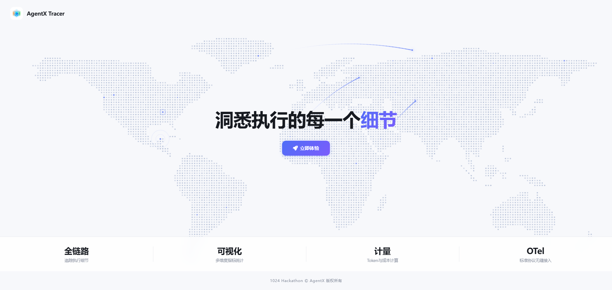
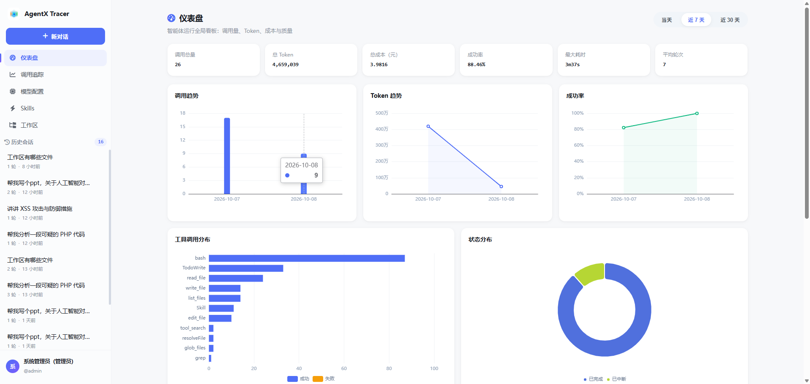
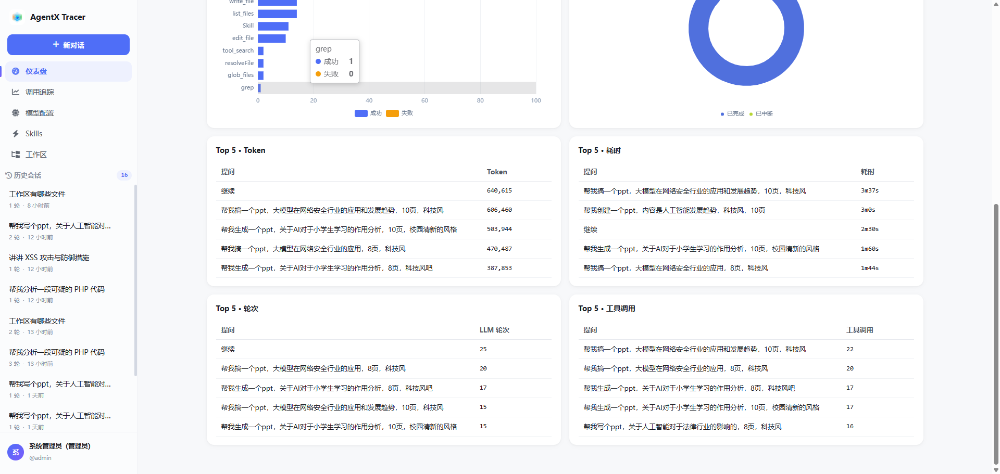
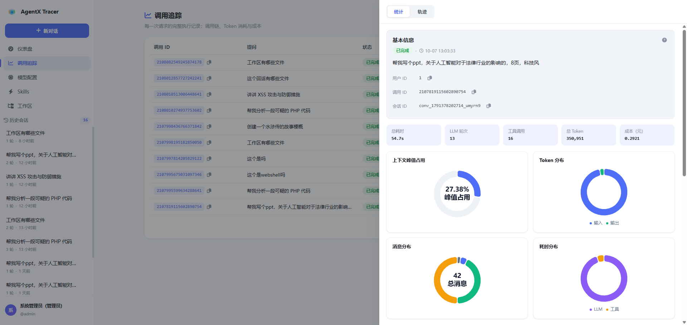
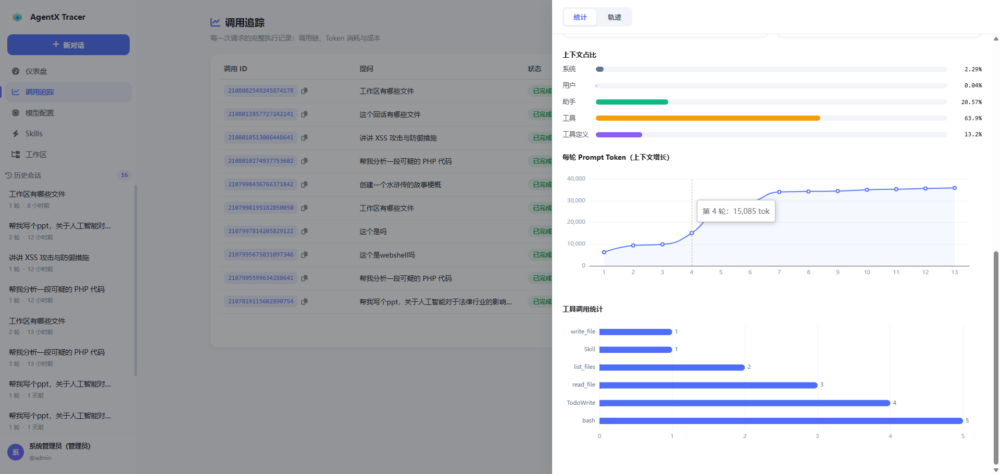
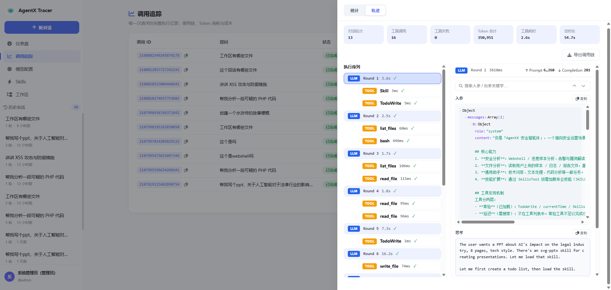
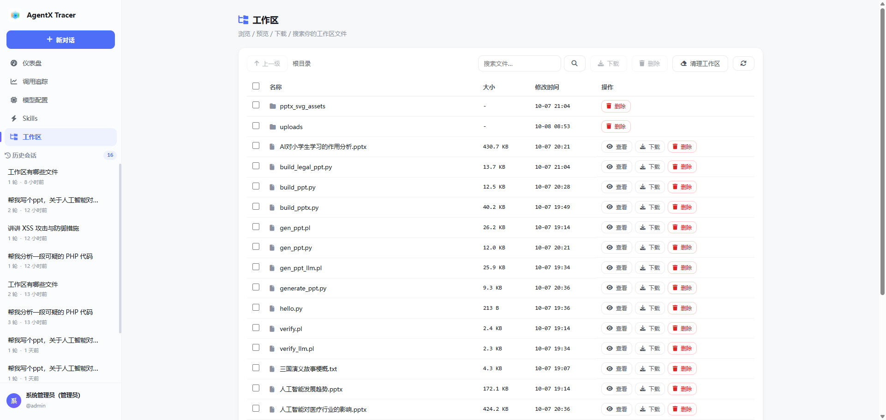
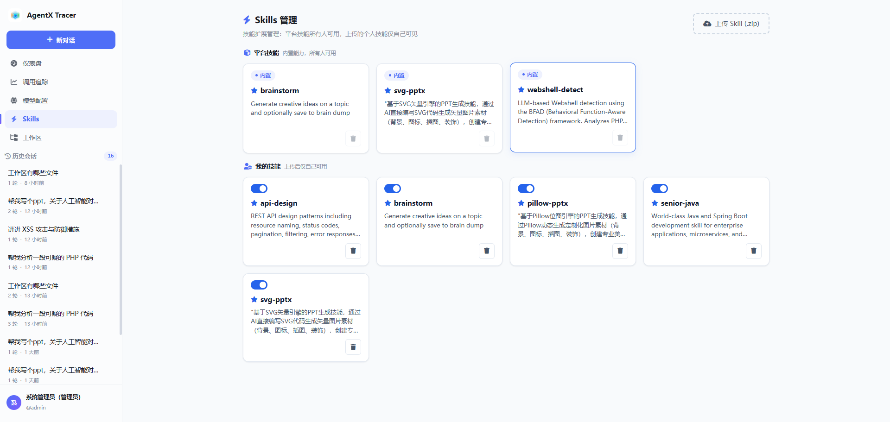
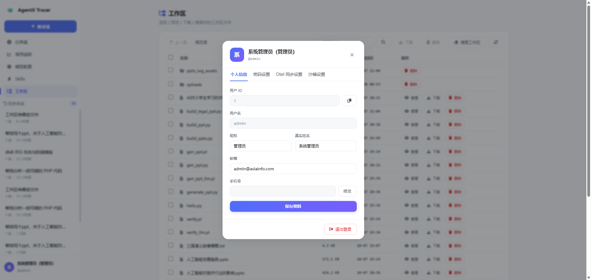
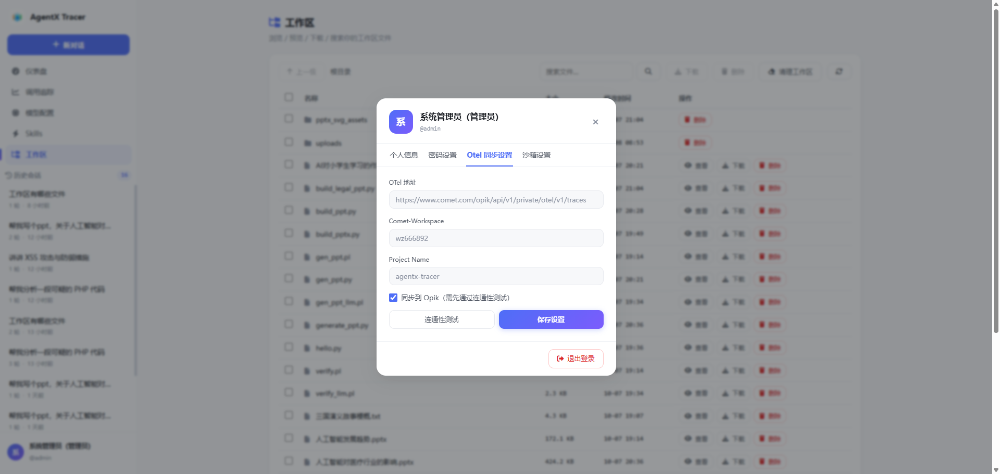

# AgentX Tracer

> **让 Agent 从黑盒变白盒** —— 智能体运行时可观测与 Token 计量平台

基于自研 [spring-ai-agentx](https://github.com/bigchuidw3/spring-ai-agentx) 框架构建，把每一次 Agent 调用的**推理过程、工具执行、Token 消耗、成本与质量**，以可交互的仪表盘、调用追踪与 Span 轨迹完整呈现。

---

## 为什么需要 AgentX Tracer

LLM 应用正从「单次问答」演进为「多轮推理 + 工具调用 + 子代理协作」的 Agent 形态，而 Agent 内部是一个**黑盒**：跑了多少轮？调了哪些工具？每一步消耗多少 Token、花多少钱？在哪一步失败、为什么失败？

这些问题不可见，Agent 的调试、优化与成本治理就无从谈起。

AgentX Tracer 把 Agent 的每一次执行拆解为可观测的 **Span 轨迹**，向上聚合为 **指标看板** 与 **成本账单**，向下穿透到**每一轮推理、每一次工具调用的完整原文**——让 Agent 可诊断、可度量、可治理。

---

## 核心功能

### 智能体对话（Agent 运行时）

- **SSE 流式输出**：实时渲染思考（reasoning）、正文、工具调用过程
- **工具调用**：多工具并发执行，结果按序归并
- **断点续传**：刷新 / 断网后按事件序号恢复流式输出
- **中断与恢复**：人工干预（HITL）暂停，保留现场后继续执行
- **上下文压缩**：L1–L6 六档策略，超长上下文自动摘要 / 卸载

### 调用追踪（核心能力）

- **调用列表**：分页、按状态 / 模型 / 关键词筛选
- **统计页签**：基本信息、Token 累计、上下文窗口占用与占比、消息计数
- **轨迹页签**：统一 Span 执行序列（LLM 推理 / TOOL 工具 / COMPACT 压缩）、工具度量（次数 / 失败率 / P50 / P95 / Max）、每轮 Prompt 折线
- **Span 全文**：任意 Span 的入参、出参、思考内容一键展开
- **可观测 ID**：用户 ID / 调用 ID / 会话 ID 三级标识，一键复制，便于跨平台关联

### 仪表盘（指标大屏）

- **KPI**：调用量、Token、成本、成功率、最大耗时、平均轮次
- **趋势**：当天按小时 / 近 7 天 / 近 30 天联动
- **分布**：工具使用分布、状态分布
- **Top 榜**：Token / 耗时 / 轮次 / 工具调用 TOP 5，可下钻

### Token 计量与成本治理

- **实时成本折算**：按当前激活模型单价，prompt / completion 分别计价
- **月度预算**：云账单式月度阈值，80% / 100% 两级告警
- **预算概览**：当月成本环形图

### Opik / OpenTelemetry 无缝接入

- 通过 **OTLP 标准协议**一键导出到 Opik 观测平台
- **用户级开关**：个人中心自主选择是否开启同步
- **连通性测试**：一键验证 OTel 端点可达性
- **噪声过滤**：只保留 Agent 调用链（agent / LLM span），屏蔽 HTTP / 定时任务 / JDBC 等框架噪声

### 安全沙箱（兄弟容器）

- **兄弟容器模式**（非 DinD）：通过宿主 Docker 运行与平台平级的隔离容器
- 用户级隔离（IsolationScope.USER），每次调用独立容器
- 工作区快照 / 恢复，个人中心自主开关

### 工作区文件浏览器

- 文件**预览**（文本 + 图片）、**下载**、**搜索**、**删除**、**清理**
- 复选框**批量下载**（打包 zip）、**批量删除**
- 全路径安全校验，防目录穿越

### 多模型管理

- 每用户独立配置模型（endpoint / key / 模型名 / 单价 / 上下文窗口）
- 动态切换激活模型，支持 OpenAI 兼容协议

### Skills 技能管理

- **用户级隔离**：平台内置技能（只读）+ 个人技能（可增删改）
- 上传 zip 技能包、启用 / 停用、描述管理

### 短信登录（ToC 形态）

- 阿里云短信验证码，注册即登录、手机号改绑、密码重置
- 注册闭环校验：用户名 + 手机号唯一性

### 多用户数据隔离

- 全链路 `user_id` 隔离：会话 / Trace / 消息 / 统计 / 成本
- 新用户只看到自己的数据，天然多用户隔离

---

## 界面预览

### 欢迎页

平台入口，一句话点明核心价值。



### 仪表盘

KPI 指标 + 调用趋势 + Top 榜，Token / 成本 / 质量一屏总览。




### 调用追踪

**统计页签**：基本信息、Token 累计、上下文窗口占用与消息计数。




**轨迹页签**：统一 Span 执行序列，工具度量与每轮交互入参出参可视化。



### 工作区

文件预览、搜索、批量下载与删除。



### Skills 管理

平台内置技能 + 个人技能，用户级隔离。



### 个人中心

用户信息、使用情况，以及 Opik 同步开关。




---

## 技术亮点

1. **自研框架背书**：构建于从 0 到 1 的 `spring-ai-agentx`（GitHub 近 200 Star），技术深度与工程成熟度有真实生产验证。
2. **可观测闭环**：底层 Span 轨迹 → 中层指标统计 → 上层成本账单，三层打通，而非孤立的功能堆砌。
3. **全链路多用户隔离**：所有数据按 `user_id` 隔离，天然支持多用户形态，数据安全从存储层保证。
4. **安全执行边界**：工具执行落在兄弟容器沙箱内，网络可禁、资源可限、快照可回滚。
5. **标准协议接入**：基于 OTel / OTLP 标准协议对接 Opik，零厂商锁定。
6. **生产级交互细节**：SSE 断点续传、中断恢复、上下文压缩、消息链缓存秒开，对标成熟产品的体验打磨。

---

## 技术架构

```
┌────────────────────────────────────────────────────────────┐
│                        前端（Vue 3 + ECharts）                 │
│   对话 / 调用追踪 / 仪表盘 / 模型管理 / Skills / 工作区         │
└──────────────────────────────┬─────────────────────────────┘
                               │ SSE / REST（Sa-Token 认证）
┌──────────────────────────────▼─────────────────────────────┐
│                     AgentX Tracer（Spring Boot 3.5）         │
│   AgentService · ObservService · DashboardService            │
│   CostService · WorkspaceService · SandboxConfigService      │
└──────────────────────────────┬─────────────────────────────┘
                               │
┌──────────────────────────────▼─────────────────────────────┐
│              spring-ai-agentx（Agent 运行时框架）             │
│   ReactAgent · AgentLoopExecutor · TraceStore/TraceManager   │
│   SandboxManager · ContextCompactor · LongTermMemory         │
└──────────────┬───────────────────────────┬──────────────────┘
               │                           │
    ┌──────────▼──────────┐     ┌──────────▼──────────┐
    │   MySQL / Redis /   │     │  Opik（OTel/OTLP）   │
    │      MinIO          │     │  Docker 沙箱（兄弟容器）│
    └─────────────────────┘     └─────────────────────┘
```

**技术栈**：Spring Boot 3.5.6 · Java 21 · Spring AI 1.1.0 · MyBatis-Plus 3.5.5 · Sa-Token · Vue 3 · ECharts · MySQL · Redis · MinIO · OpenTelemetry

---

## 快速开始

```bash
# 1. 打包
mvn -o package -DskipTests

# 2. 准备本地配置（复制模板并填入真实值）
cp src/main/resources/application-example.yml src/main/resources/application.yml

# 3. 部署
# 部署包（deploy/：Dockerfile、install.sh/update.sh、init.sql、基础镜像）含真实配置，另行提供
# 部署步骤见部署包内 deploy/README.md

# 4. 访问
# http://<服务器IP>:8090
```

> 本地配置（`application.yml`）不入库，提交的 `application-example.yml` 是占位符模板；部署包 `deploy/` 因含真实配置与内部基础镜像，单独提供、不进仓库。

---

## 目录结构

```
agentx-tracer/
├── src/main/java/com/agentx/tracer/
│   ├── auth/           # 认证（Sa-Token + 短信登录）
│   ├── chat/           # 多模型动态接入
│   ├── controller/     # 对话 / 仪表盘 / 可观测 / 工作区 / 文件
│   ├── observability/  # Opik / OTel 集成
│   ├── service/        # 核心业务（统计 / 成本 / 沙箱 / 工作区）
│   ├── tools/          # Agent 工具（文件 / 诊断）
│   └── hook/           # 预算告警 Hook
├── src/main/resources/static/   # 前端（Vue 3 本地化，内网离线可用）
├── skills/             # 内置 + 用户技能
└── deploy/             # 部署脚本 + Dockerfile + init.sql
```
